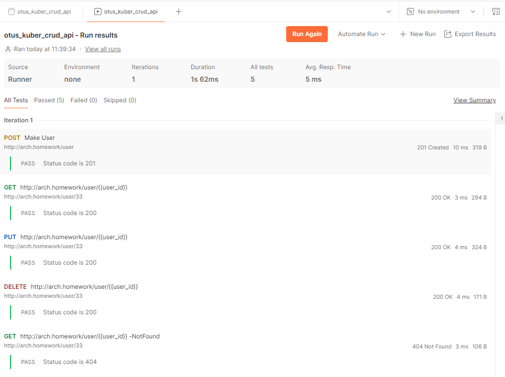

# Начальные условия:

- Установленный minikube (https://kubernetes.io/ru/docs/tasks/tools/install-minikube/)
- в etc/hosts указан arch.homework c ip кластера (minikube ip)
- активирован ingress (minikube addons enable ingress)
- установлен менеджер пакетов Helm (https://helm.sh/docs/intro/install/)

# Развертывание приложения и БД

1. Cоздание namespace myns и конфигов/секретов.
 
    `kubectl apply -f 01-ns-sec.yaml`

Создаст:
	- myns 
	- crud-api-secrets 
	- crud-api-configmap

Можно задать текущий namespace по умолчанию для удобства работы с ним:

   `kubectl config set-context --current --namespace=myns`


2. Установка БД postgresql:16 в namespace myns с помощью Helm:

    `helm install pg16 bitnami/postgresql -f values.yaml --namespace myns`

Команда должна создать экземпляр БД postgresql в namespace myns с конфигурацией из values.yaml. 
Адрес внутри кластера: pg16-postgresql.myns


3. Создание и деплой Web сервиса CRUD API:

    `kubectl apply -f 02-api.yaml`

Создаст:

  - Deployment crud-api
  - Service crud-api-service
  - Ingress crud-api-ing

Так же будет автоматически применена миграция базы данных.

Можно проверить логи приложения с помощью команды:

    `kubectl logs deployment/crud-api -n myns`

Лог должен выглядеть примерно так : 
```
Wait for DB ...
Wait for DB ...
info: Program[0]
      Start DB migrations
info: Program[0]
      DB Migration finished
info: Microsoft.Hosting.Lifetime[14]
      Now listening on: http://[::]:8080
info: Microsoft.Hosting.Lifetime[0]
      Application started. Press Ctrl+C to shut down.
info: Microsoft.Hosting.Lifetime[0]
      Hosting environment: Production
info: Microsoft.Hosting.Lifetime[0]
      Content root path: /app
```


4. Проверка доступности приложения

Приложение должно быть доступно по URL:
http://arch.homework/swagger

С помощью него можно выполнять запросы к API.

Также можно выполнять запросы с помощью коллекции Postman, из [otus_kuber_crud_api.postman_collection.json](Postman/otus_kuber_crud_api.postman_collection.json)

Пример успешного выполнения:
    

5. После проверки приложения можно удалить все созданные сущности:

`kubectl delete ns myns`

# Задание со звездочкой

Команды выполняются из каталога [Kuber](Kuber)

0. Удалить namespace myns, если в нем есть артефакты от предыдущего запуска

      `kubectl delete ns myns`

1. Создать namespace myns

      `kubectl create ns myns`

2. Установить Postgres из Helm 

    `helm install pg16 bitnami/postgresql -f values.yaml --namespace myns`

    По логам убедиться, что pod успешно проинициализировался

3. Устновить приложение с помощью Helm

      `helm install my-crud-api .\crud-api\ --namespace myns`

4. Проверить работу с помощью коллекции Postman, из первой части

5. Удалить namespace с артефактами

      `kubectl delete ns myns`