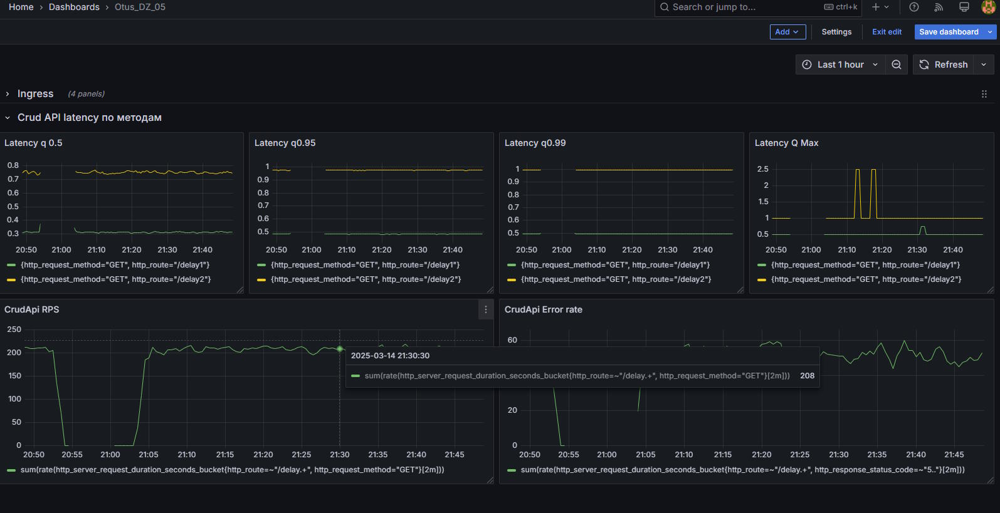
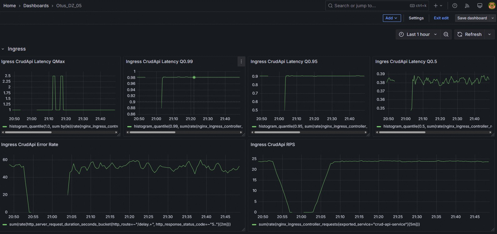

# Домашнее задание 05 - Prometheus и Grafana

> На выходе должно быть:
> 
> 0) скриншоты дашборды с графиками в момент стресс-тестирования сервиса. Например, после 5-10 минут нагрузки.
> 
>1) json-дашборды.

## I. Сделать дашборд в Графане, в котором были бы метрики с разбивкой по API методам.
  1.	Latency (response time) с квантилями по 0.5, 0.95, 0.99, max
  2.	RPS
  3.	Error Rate - количество 500ых ответов

Добавил графики в панель **Crud API Latency по методам**:

## II. Добавить в дашборд графики с метрикам в целом по сервису, взятые с nginx-ingress-controller.
  1.	Latency (response time) с квантилями по 0.5, 0.95, 0.99, max
  2.	RPS
  3.	Error Rate - количество 500ых ответов

Добавил графики в панель **Ingress**:

## III. Дашборд в JSON формате
[crud-api-dashboard.json](crud-api-dashboard.json)

Схема для единого дашборда.
Состоит из двух частей (Rows) - для Ingress и CrudApi.
