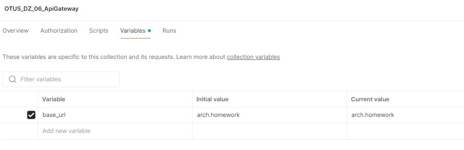
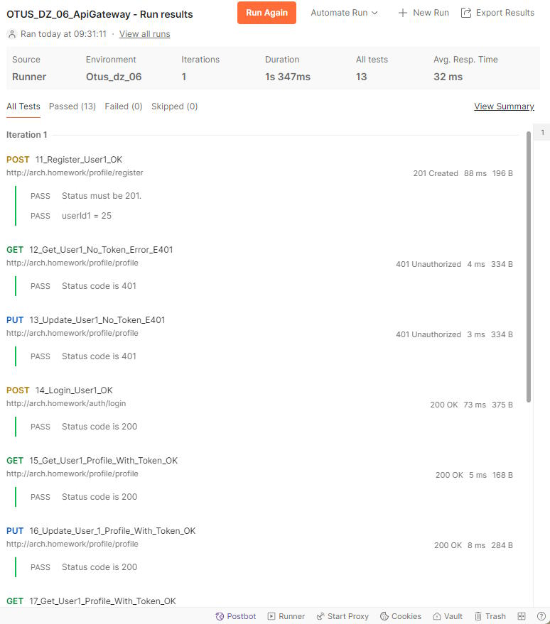

# Описание схемы взаимодействия сервисов

## Для `/profile/register`
- Клиент отправляет `GET /profile/register` → **Nginx** → `GET /register` → **`userprofile-service`** → Ответ → Клиент (без аутентификации).

## Для `/profile/profile`
1. Клиент отправляет `GET /profile/profile` → **Nginx Ingress**.
2. Nginx отправляет `GET /auth` → **`auth-service`** (пересылает заголовки клиента).
3. **`auth-service`**:
   - Проверяет токен.
   - Если успех: возвращает `200 OK` + `X-User-Id: 12345`.
   - Если ошибка: возвращает `401 Unauthorized`.
4. Если успех, Nginx отправляет `GET /profile` + `X-User-Id: 12345` → **`userprofile-service`**.
5. **`userprofile-service`** обрабатывает и возвращает ответ → **Nginx** → Клиент.

## Изображение схемы


# Установка и настройка сервисов

## Перейти в каталог Kuber

`cd Kuber`

## Создать namespace myns
`kubectl create ns myns`

### Результат: в консоли 
`namespace/myns created`

## Установить Postgresql

`helm install pg16 bitnami/postgresql -f pg-values.yaml --namespace myns`

### Результат: 
в консоли отобразится справочный вывод об использовании Helm пакета и сервиса PG

## Установить сервисы

`kubectl apply -f ./services.yaml --namespace myns`

### Результат: в консоли
```
configmap/db-config created
deployment.apps/auth-deployment created
service/auth-service created
deployment.apps/userprofile-deployment created
service/userprofile-service created
```

## Установить ingress правила (для Nginx Ingress Controller)

`kubectl apply -f ./ing.yaml --namespace myns`

### Результат: в консоли

```
ingress.networking.k8s.io/public-ingress-auth-service created
ingress.networking.k8s.io/public-ingress-profile-register created
ingress.networking.k8s.io/profile-ingress-use-auth created
```

# Тесты Postman
Файлы расположены в каталоге Postman

- Загрузить коллекцию из [OTUS_DZ_06_ApiGateway.postman_collection.json](Postman/OTUS_DZ_06_ApiGateway.postman_collection.json)

- Указать значение переменной **base_url** = arch.homework в Variables для коллекции *OTUS_DZ_06_ApiGateway*


- Запустить тесты для коллекции *OTUS_DZ_06_ApiGateway*

### Результат:
[Export результатов тестов из Postman](Postman/OTUS_DZ_06_ApiGateway.postman_test_run.json)

#### Окно с выводом ( не полностью )

