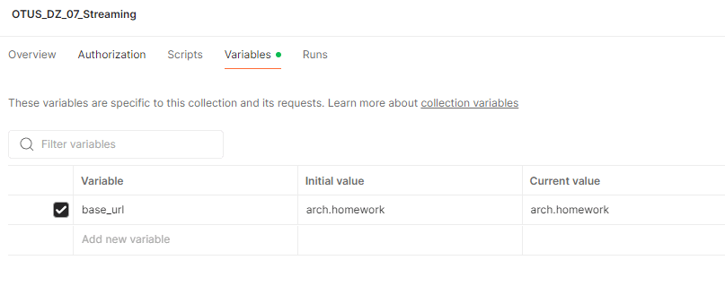
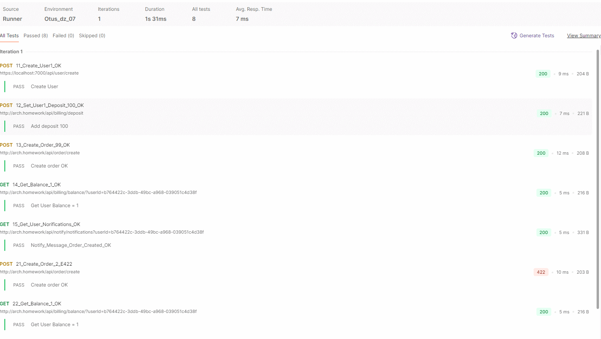

# Домашнее задание №7 - Stream processing

Реализовать сервис заказа. Сервис биллинга. Сервис нотификаций.

## Варианты схем взаимодействия

### Только HTTP


### Событийное взаимодействие с использование брокера сообщений для нотификаций (уведомлений)


### Event Collaboration cтиль взаимодействия с использованием брокера сообщений


В итоге выбрал вариант - **только HTTP**, как наиболее простой и удовлетовряющий требованиям задания. 


## Установка и настройка сервисов

## Предварительные условия

- Ingress Nginx доступен по адресу arch.homework


## Перейти в каталог Kuber

`cd Kuber`

## Создать namespace myns
`kubectl create ns myns`

### Результат: в консоли 
`namespace/myns created`

## Установить Postgresql

`helm install pg16 bitnami/postgresql -f pg-values.yaml --namespace myns`

### Результат: 
в консоли отобразится справочный вывод об использовании Helm пакета и сервиса PG

Нужно убедиться в логах пода, что PG запустился и принимает соединения.

## Установить сервисы и ingress

`kubectl apply -f ./pods_svcs.yaml --namespace myns`

### Результат: в консоли

```
configmap/db-config-billing created
configmap/db-config-notify created
deployment.apps/user-service created
service/user-service created
deployment.apps/order-service created
service/order-service created
deployment.apps/notify-service created
service/notify-service created
deployment.apps/billing-service created
service/billing-service created
deployment.apps/apigateway-svc created
service/apigateway-svc created
ingress.networking.k8s.io/apigateway-ingress created
```
# Тесты Postman
Файлы расположены в каталоге Postman

- Загрузить коллекцию из [OTUS_DZ_07_Streaming.postman_collection.json](Postman/OTUS_DZ_07_Streaming.postman_collection.json)

- Указать значение переменной **base_url** = arch.homework в Variables для коллекции *OTUS_DZ_07_Streaming*


- Запустить тесты для коллекции *OTUS_DZ_06_ApiGateway*

### Результат:
[Json файл с результатами тестов из Postman](Postman/OTUS_DZ_07_Streaming.postman_test_run.json)

#### Окно с выводом ( не полностью )


