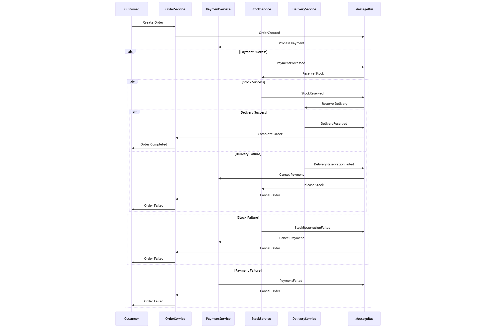
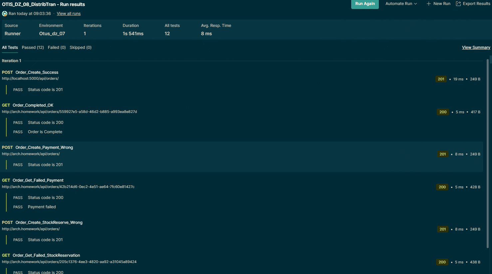

# Домашнее задание №8 - Распределенные транзакции

## Сценарий для интернет-магазина:

Реализовать сервисы "Платеж", "Склад", "Доставка".

Для сервиса "Заказ", в рамках метода "создание заказа" реализовать механизм распределенной транзакции (на основе Саги или двухфазного коммита).

Во время создания заказа необходимо:
1.	в сервисе "Платеж" убедиться, что платеж прошел
2.	в сервисе "Склад" зарезервировать конкретный товар на складе
3.	в сервисе "Доставка" зарезервировать курьера на конкретный слот времени.

Если хотя бы один из пунктов не получилось сделать, необходимо откатить все остальные изменения.

## Архитектурное решение
Выбрал реализацию паттерна Sage на базе библиотеки C# MassTransit + RabbitMQ в качестве очереди сообщений.

### Схема взаимодействия сервисов в паттерне Saga

### Реализация Saga
Алгоритм "Saga" реализован в сервисе Orders - [OrderSaga.cs](Api/Orders/Saga/OrderSaga.cs)

## Установка и настройка сервисов

### Предварительные условия

- Ingress Nginx доступен по адресу arch.homework
- В minikube добавлен repo bitnami - `helm repo add bitnami https://mirror.yandex.ru/helm/charts.bitnami.com/`
-  обновить репо, если необходимо - `helm repo update`

### Установка
- Клонировать repo c Github
- Перейти в каталог `Kuber`

#### Рекомендуется установка из cmd файла:
- Выполнить из командной строки [setup.cmd](Kuber/setup.cmd). Убедиться в отсутствии ошибок.

#### Или выполнить следующие команды, по отдельности:

Порядок выполнения команд

`kubectl create ns myns` - создать namespace

`helm install pg16 bitnami/postgresql -f pg-values.yml --namespace myns` - установить PostgresSql. Убедиться что поды запустились без ошибок.

`helm install rabbit bitnami/rabbitmq -f rmq-values.yml --namespace myns` - установить RabbitMq. Убедиться что поды запустились без ошибок.

`kubectl apply -f init-svcs.yml` - развернуться все сервисы приложений - Orders(Заказы), Payments(Платеж), Delivery(Доставка), Stocks(Склад).
Убедиться в отсутствии ошибок.

`kubectl apply -f gate.yml` - развернуть api gateway

## Тестирование в Postman
- Загрузить [коллекцию Postman](Postman/OTIS_DZ_08_DistribTran.postman_collection.json)

- Выполнить тесты

### Пример результатов
- Экспорт json [результатов из Postman](Postman/OTIS_DZ_08_DistribTran.postman_test_run.json)

- Скриншот результатов Postman

> Если тесты Orders_Get_* проваливаются и в ответе  status: "Pending", то нужно в Test Runner указать задержку между тестами 100-150 ms, чтобы сервисы успевали отработать между запросами.

## Очистка minikube
- Для удаления сервисов выполнить команду `kubectl delete ns myns`.
- Если требуется, то можно удалить Persisted Volumes с сохраненными данными для pg16 и rabbitmq.