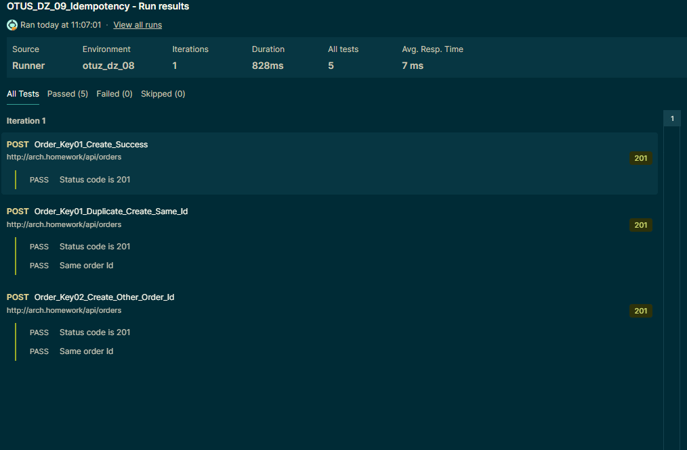

# Домашнее задание №9 - Идемпотентость и коммутативность API в HTTP и очередях

Использовать сервис "Заказ" из прошлого занятия и для одного из его методов, например, "создание заказа" сделаете идемпотетным.

## Архитектурное решение
Для метода создания заказа POST /api/orders применил паттерн "Ключи идемпотентности".
В качестве ключа использую заголовок Idempotency-Key в котором передаю ключ идемпотентности.

Логика реализована в файле [OrdersController.cs](Api/Orders/Controllers/OrdersController.cs):
Если передавать заголовок Idempotency-Key не пустым и неизменным, то новая заявка не создается.
В ответе возвращается Id первоначально созданной заявки.

## Установка и настройка сервисов

### Предварительные условия

- Ingress Nginx доступен по адресу arch.homework
- В minikube добавлен repo bitnami - `helm repo add bitnami https://mirror.yandex.ru/helm/charts.bitnami.com/`
-  обновить репо, если необходимо - `helm repo update`

### Установка
- Клонировать repo c Github
- Перейти в каталог `Kuber`

#### Рекомендуется установка из cmd файла:
- Выполнить из командной строки [setup.cmd](Kuber/setup.cmd). Убедиться в отсутствии ошибок и что поды в myns инициализировались успешно.

#### Или выполнить следующие команды, по отдельности:

Порядок выполнения команд

`kubectl create ns myns` - создать namespace

`helm install pg16 bitnami/postgresql -f pg-values.yml --namespace myns` - установить PostgresSql. Убедиться что поды запустились без ошибок.

`helm install rabbit bitnami/rabbitmq -f rmq-values.yml --namespace myns` - установить RabbitMq. Убедиться что поды запустились без ошибок.

`kubectl apply -f init-svcs.yml` - развернуться все сервисы приложений - Orders(Заказы), Payments(Платеж), Delivery(Доставка), Stocks(Склад).
Убедиться в отсутствии ошибок.

`kubectl apply -f gate.yml` - развернуть api gateway

## Тестирование в Postman
- Загрузить [коллекцию Postman](Postman/OTUS_DZ_09_Idempotency.postman_collection.json)
- Установить для переменной коллекции baseUrl значение "arch.homework"
- в Test Runner указать задержку 100 мс
- Выполнить тесты 

### Пример результатов
- Экспорт json [результатов из Postman](Postman/OTUS_DZ_09_Idempotency.postman_test_run.json)

- Скриншот результатов Postman

## Очистка minikube
- Для удаления сервисов выполнить команду `kubectl delete ns myns`.
- Если требуется, то можно удалить Persisted Volumes с сохраненными данными для pg16 и rabbitmq.