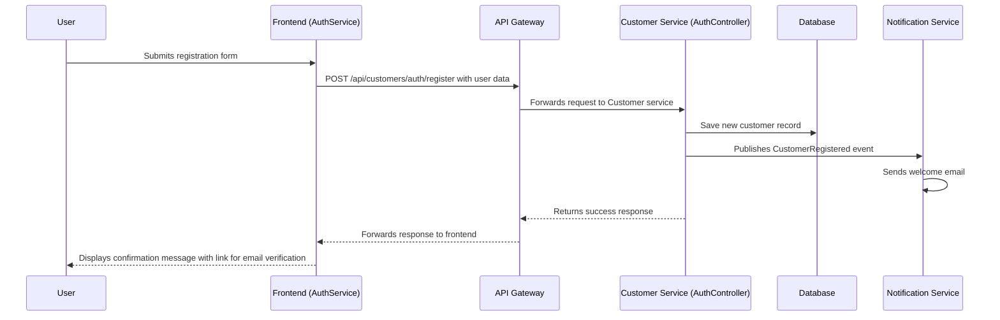

# User Registration Process

## Actors
- User (Customer)
- Frontend (AuthService)
- API Gateway
- Customer Service (AuthController)
- Database
- Notification Service

## Flow

1. **User Interaction**
   - The user accesses the registration page on the frontend.
   - The user fills out the registration form with their first name, last name, email, and password.

2. **Frontend Processing**
   - The AuthService in the frontend receives the form data.
   - It sends a POST request to the API Gateway with the registration data.

3. **API Gateway Routing**
   - The API Gateway routes the request to the Customer Service's AuthController.

4. **Customer Service Processing**
   - The AuthController validates the input data:
     - Checks if password is provided
     - Checks if email is already registered
   - If validation fails, returns appropriate error response.
   - If validation passes:
     - Generates a salt and hashes the password.
     - Creates a new Customer record in the database with the provided information.
     - Publishes a `CustomerRegistered` event to notify other services.

5. **Notification Service**
   - The Notification Service consumes the `CustomerRegistered` event.
   - It sends a welcome email to the newly registered user containing a confirmation link.

6. **Response to User**
   - The Customer Service returns a success response with the customer ID.
   - The frontend displays a confirmation message to the user, showing that an email has been sent for verification.
   - The confirmation message includes a link to confirm the email address.

## Diagram

## Key Components

- **Frontend**: Handles user interaction and sends registration data to the backend.
- **AuthService**: Manages authentication-related operations on the frontend.
- **API Gateway**: Routes requests between frontend and backend services.
- **Customer Service**: Processes registration, validates input, saves customer data, and publishes events.
- **Notification Service**: Sends emails based on events published by other services.

## Event: CustomerRegistered

The `CustomerRegistered` event is a key part of the process. It contains:
- CustomerId (Guid)
- Email (string)
- FirstName (string)
- LastName (string)

This event triggers the Notification Service to send a welcome email with verification instructions.