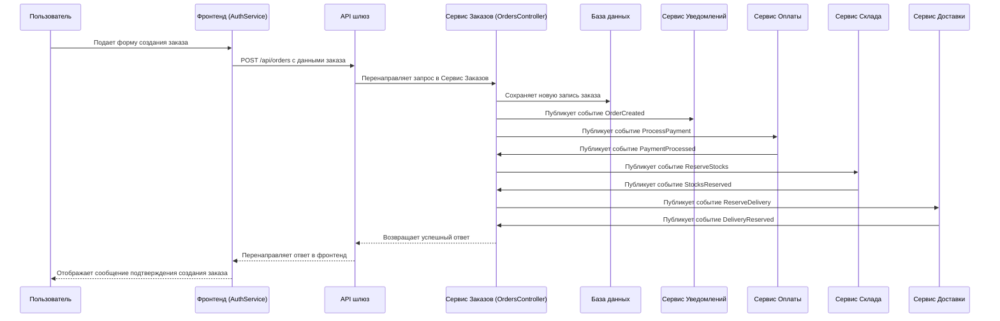

# Создание заявки в сервисе Order

## Ключевые участники
- Пользователь
- Фронтенд (AuthService)
- API шлюз
- Сервис Заказов (OrdersController)
- База данных
- Сервис Уведомлений
- Сервис Оплаты
- Сервис Склада
- Сервис Доставки

## Последовательность шагов
1. **Взаимодействие пользователя**
   - Пользователь открывает страницу создания заказа на фронтенде.
   - Пользователь заполняет форму с деталями заказа.

2. **Обработка фронтенда**
   - AuthService в фронтенде получает данные формы.
   - Он отправляет POST-запрос к API шлюзу с данными заказа.

3. **Маршрутизация API шлюза**
   - API шлюз перенаправляет запрос в Сервис Заказов's OrdersController.

4. **Обработка Сервиса Заказов**
   - Сервис Заказов сохраняет новую запись заказа в базе данных.
   - Сервис Заказов публикует событие `OrderCreated`.

5. **OrderSaga**
   - OrderSaga получает событие `OrderCreated`.
   - OrderSaga обрабатывает оплату, резервирует товары и доставляет заказ.
     - Публикует событие `ProcessPayment` для обработки оплаты.
     - Сервис Оплаты обрабатывает оплату и публикует событие `PaymentProcessed`.
     - OrderSaga получает событие `PaymentProcessed` и резервирует товары.
     - Публикует событие `ReserveStocks` для резервирования товаров.
     - Сервис Склада обрабатывает резервирование товаров и публикует событие `StocksReserved`.
     - OrderSaga получает событие `StocksReserved` и резервирует доставку.
     - Публикует событие `ReserveDelivery` для резервирования доставки.
     - Сервис Доставки обрабатывает резервирование доставки и публикует событие `DeliveryReserved`.
     - OrderSaga получает событие `DeliveryReserved` и завершает заказ.

6. **Ответ пользователю**
   - Сервис Заказов возвращает успешный ответ.
   - Фронтенд отображает сообщение подтверждения пользователю, указывая, что заказ был успешно создан.

## Диаграмма последовательности

## Ключевые компоненты
- **Фронтенд**: Обрабатывает взаимодействие пользователя и отправляет данные заказа на бэкэнд.
- **AuthService**: Управляет операциями аутентификации на фронтенде.
- **API шлюз**: Маршрутирует запросы между фронтендом и сервисами бэкэнда.
- **Сервис Заказов**: Обрабатывает создание заказа, сохраняет данные в базе данных, публикует события и управляет процессом заказа.
- **OrderSaga**: Обрабатывает бизнес-логику заказа, включая оплату, резервирование товаров и доставку.
- **Сервис Уведомлений**: Отправляет уведомления на основе событий, опубликованных другими сервисами.
- **Сервис Оплаты**: Обрабатывает оплату заказа.
- **Сервис Склада**: Резервирует товары для заказа.
- **Сервис Доставки**: Резервирует доставку для заказа.