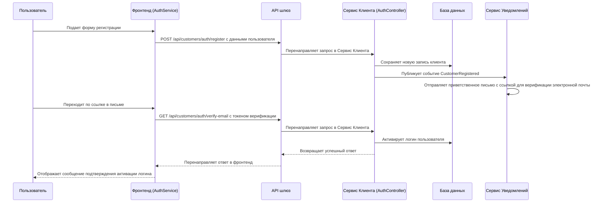

# Регистрация клиента

## Ключевые участники
- Пользователь
- Фронтенд (AuthService)
- API шлюз
- Сервис Клиента (AuthController)
- База данных
- Сервис Уведомлений

## Последовательность шагов
1. **Взаимодействие пользователя**
   - Пользователь открывает страницу регистрации на фронтенде.
   - Пользователь заполняет форму регистрации с именем, фамилией, электронной почтой и паролем.

2. **Обработка фронтенда**
   - AuthService в фронтенде получает данные формы.
   - Он отправляет POST-запрос к API шлюзу с данными регистрации.

3. **Маршрутизация API шлюза**
   - API шлюз перенаправляет запрос в Сервис Клиента's AuthController.

4. **Обработка Сервиса Клиента**
   - Сервис Клиента сохраняет новую запись клиента в базе данных.
   - Сервис Клиента публикует событие `CustomerRegistered`.

5. **Сервис Уведомлений**
   - Сервис Уведомлений получает событие `CustomerRegistered`.
   - Он отправляет приветственное письмо с ссылкой на подтверждение электронной почты новому зарегистрированному пользователю.

6. **Активация логина**
   - Пользователь переходит по ссылке в письме.
   - AuthService отправляет GET-запрос к API шлюзу с токеном верификации.
   - API шлюз перенаправляет запрос в Сервис Клиента.
   - Сервис Клиента активирует логин пользователя в базе данных.

7. **Ответ пользователю**
   - Сервис Клиента возвращает успешный ответ.
   - Фронтенд отображает сообщение подтверждения пользователю, указывая, что логин был успешно активирован.

## Диаграмма последовательности

## Ключевые компоненты
- **Фронтенд**: Обрабатывает взаимодействие пользователя и отправляет данные регистрации на бэкэнд.
- **AuthService**: Управляет операциями аутентификации на фронтенде.
- **API шлюз**: Маршрутирует запросы между фронтендом и сервисами бэкэнда.
- **Сервис Клиента**: Обрабатывает регистрацию, сохраняет данные клиента в базе данных, публикует события и активирует логин пользователя.
- **Сервис Уведомлений**: Отправляет электронные письма на основе событий, опубликованных другими сервисами.
